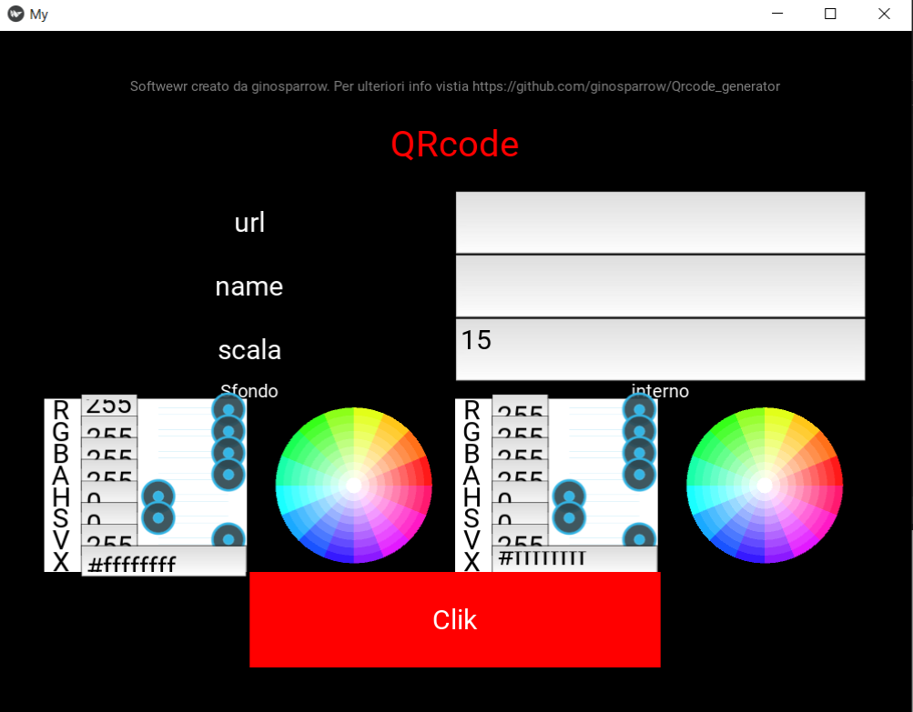

# Qrcode generator

Non c'è molto da dire su questo programa. Il titolo dice già tutto 😅

### indice
- installazione
- come funziona ? 🤔

## installazoine

In relata se siete utenit Windows non serve istallare nulla. trovate il fai .exe già pronto.

Windows: file .exe

Linux: bisogna compilare il fail sul vostro pc. 

Per eseguire il codice bisogna istallare python consiglio la versione 3.11.7.  

Per la componete grafica installare Kivy (melgio se la versione 2.3.0)

    pip install Kivy
per mggiori info lascio anche il link per la libreria [Kivy]('https://kivy.org/')
Per la generazione del qrcode installare PyQRCode (melgko la verisone  1.2.1)

    pip install pyqrcode

per mggiori info lascio anche il link per la libreria [pyqrcode]('https://pypi.org/project/PyQRCode/')

il file querrecode.kv e il file che gestisce la parte grafica.(puo essere compilata per Windous, Linux, Macos, Android, Ios)    
Invece querreCode.py gestisce la partelogica che andra a generare il qrcode.  

## come funziona? 🤔

Molto semplice. Appena si avvia l'applicazione vedremo questa scermata.

Ora bastera riempire i campi richiesti  
 - url : inserire l'indirizzo link che si vuole convertire in qrcode.
 - name: il nome del file che vera generato.
 - scala: e la grandezza della immagine. di defoult e impostato a 15%.
 - poi si puo decidere il colore dello sfondo e dei quadrati neri . Se non modificati lo sfondo e bianco e i quadrati neri.

ultimo passagio cliccare il tasto **Clik**

il file vera generato nella stessa cartella del eseguibile (più avanti implementero anche la possibilita di scelgiere la cartella dove salvare il file)
